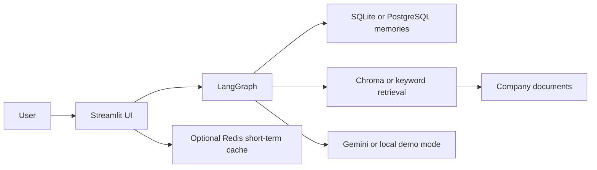

# Enterprise AI Assistant

Enterprise AI Assistant is a production-style Streamlit application that combines LangGraph orchestration, Gemini, durable local or PostgreSQL records, optional Redis conversation cache, and a persistent knowledge base. It keeps short-term conversation state separate from long-term user memory and organization documents.

## Features

- User-isolated conversations, messages, and durable memories
- Local SQLite by default, with PostgreSQL available for production
- Redis recent-history cache with graceful degradation
- LangGraph routing for general, memory, RAG, and hybrid questions
- Secure PDF, TXT, DOCX, and Markdown ingestion with SHA-256 duplicate detection
- Chroma vector retrieval with Gemini embeddings when configured, plus offline keyword retrieval for local demos
- Gemini generation, professional Streamlit UI, optional Docker Compose, logging-ready configuration, and pytest coverage

## Architecture



## Setup

Use Python 3.11 or newer.

```powershell
python -m venv .venv
.\.venv\Scripts\Activate.ps1
pip install -r requirements.txt
Copy-Item .env.example .env
python scripts/init_db.py
python scripts/ingest_documents.py
streamlit run app/main.py
```

By default the app uses SQLite at `data/local_app.db`, so Docker is not required. Set `GOOGLE_API_KEY` in `.env` when you want real Gemini answers; without it, the app still opens in local demo mode.

Docker is optional. If you later want the full Postgres/Redis stack, run:

```powershell
docker compose up --build
```

## Tests

```powershell
pytest -q
```

The tests use SQLite and deterministic LLM/retrieval doubles, so no production credentials are needed.

## Demo questions

1. `Hello`
2. `Remember that I prefer Python examples.` then `What language should you use for my examples?`
3. `What is the annual leave policy?`
4. `What is our remote work policy, and what programming language do I prefer?`

The included `data/documents/sample_company_policy.md` is fictional sample content for demonstrations. Ingest it before RAG testing. The assistant only claims a company-policy fact when retrieved document evidence is present.

## Project structure

`app/` contains graph, memory, RAG, database, LLM, services, and UI modules; `scripts/` contains operational commands; `tests/` contains offline-safe coverage; `data/` contains uploaded documents and the persisted vector store.

## Operations and security

Secrets live only in environment variables; `.env` is excluded from Git. Upload names are normalized, extensions and size are validated, database access is filtered by user ID, and Redis is optional rather than a single point of failure. Future improvements include authentication/SSO, per-document deletion from Chroma, audit logs, and async streaming tokens.

## License

MIT
